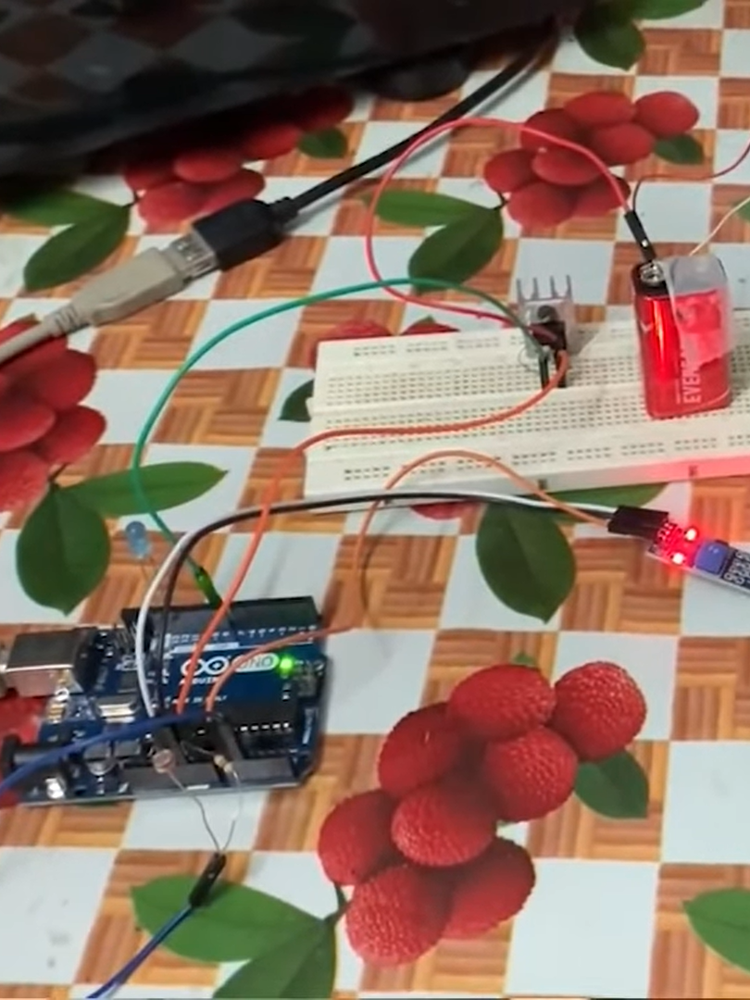
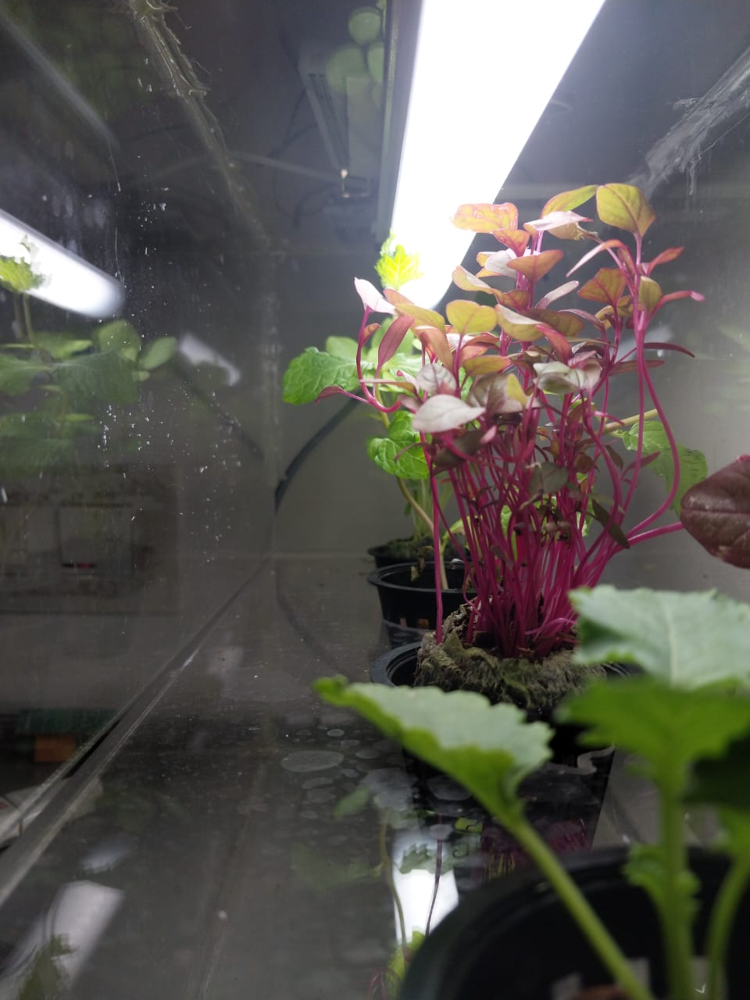

# Garduino v2.0

## Automated space farming solutions since 2022

 

# Project Description

TERRAMARS is a parent project of Garduino aimed at terraforming Mars into a habitable planet to support future human colonization missions.

 

# [Youtube Link](https://youtu.be/CUlLc_mFOrE)
# [Devfolio Link](https://devfolio.co/projects/garduino-v-abd8)

## Garduino v1.0 : The Precursor

Garduino started as a automated IoT horticulture project by four college freshmen.

 

## Garduino v2.0 : The Upgrade

They realised farming wasn't limited to Earth and began to explore extraplanetary solutions.

 

## Garduino v3.0: Asking too much?

The final iteration of the Garduino project, that will terraform Mars bit by bit.

 

## Dependencies

Refer: [dependencies.txt](dependencies.txt)

 

# Stack Used

Software

- Python (Django, OpenCV, TensorFlow)
- HTML
- CSS
- JavaScript

Hardware

- Arduino
- Water pump
- LEDs
- DHT11 Sensor
- LDR
- Motor driver

 

# Team Members
1. Abhinand D Manoj
2. Adithya Biju
3. Alosh Denny
